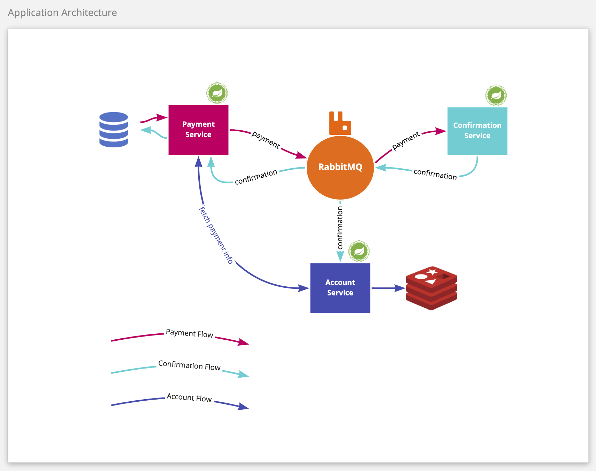
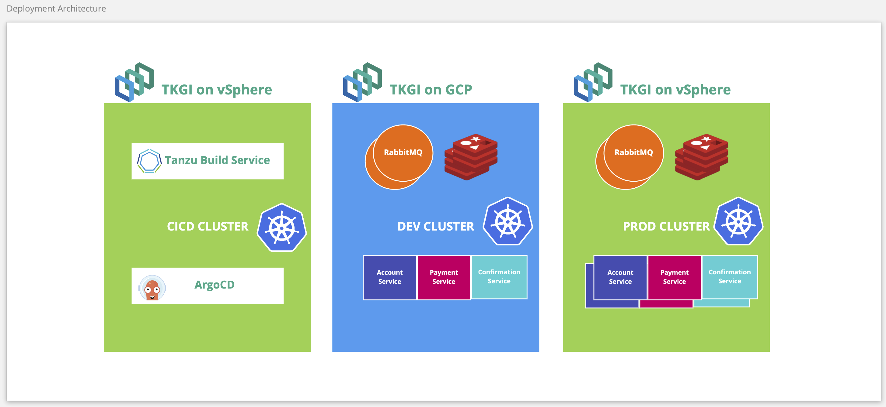
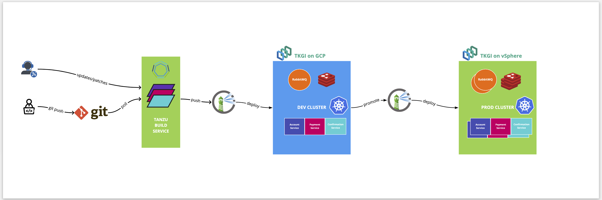

# VMware Tanzu Demo

Demo material for developers on [VMware Tanzu](https://tanzu.vmware.com/).

Consists of three [Spring Boot](https://spring.io) microservices, communicating over [RabbitMQ](), backed by a Postgres database, all running on Kubernetes.

## Use Case - Banking Application

#### Application Architecture

#### Deployment Diagram

#### Continuous Delivery Diagram

## Installation

TODO